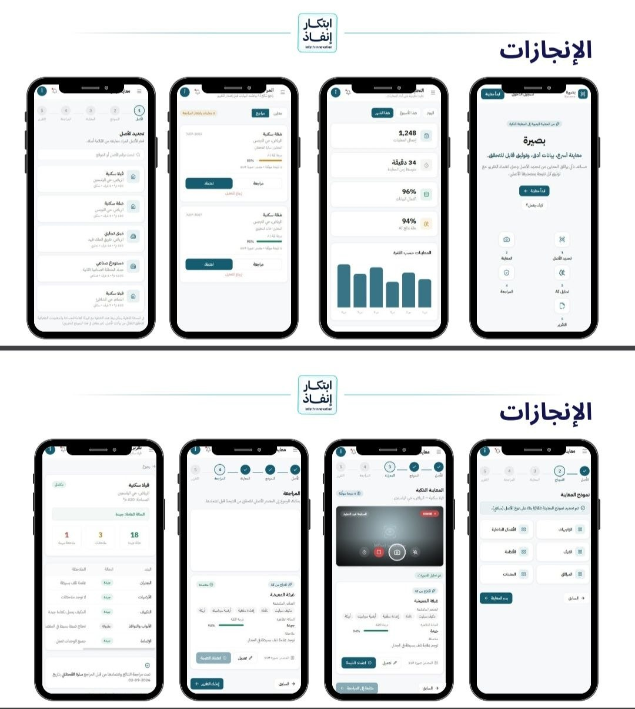

# بصيرة (Basira) — AI-Assisted Property Inspection Prototype

**Basira** (Arabic: بصيرة, "insight") is an Arabic-first, RTL prototype exploring how AI can speed up
property inspections while keeping a human reviewer firmly in control of every finding that ends up
in a final report.

> **Status: Prototype / demo.** All "AI" detections, confidence scores, and government/registry
> integrations in this repository are mocked with static sample data for demonstration purposes.
> Nothing here is connected to a real computer-vision model, a real backend, or a real government
> system. See [Prototype Status](#prototype-status) below.

## Overview

Property and asset inspections today are largely manual: an inspector walks a site, takes photos,
and later writes up findings by hand. This is slow, inconsistent between inspectors, and hard to
audit — a reviewer has to trust the write-up because it's difficult to trace a claim back to the
photo it came from.

Basira demonstrates a workflow where an inspector captures assets and photos as before, but a
proposed set of AI-generated findings (detected objects, condition, confidence score) is presented
alongside each source photo. A human reviewer then approves, edits, or rejects each finding before
it becomes part of the final report — so AI accelerates documentation without removing human
judgment or the ability to verify the source.

## Problem

- Manual inspection write-ups are time-consuming and inconsistent across inspectors.
- Findings in a report are hard to trace back to the photo/evidence that produced them.
- Reviewers currently have no structured way to audit AI-assisted claims before they become
  official documentation.

## Solution

Basira proposes a structured, auditable pipeline:

1. Capture inspection assets and photos.
2. Generate suggested findings per photo (object detected, condition, confidence).
3. Route every suggested finding through a human reviewer for **approve / edit / reject**, with a
   direct link back to the source photo.
4. Compile only reviewer-approved findings into the final, shareable report.

## Main Workflow

```
Landing → Login (demo auth) → Dashboard
   → New Inspection (select asset → template → capture)
   → Smart Inspection (AI-suggested findings per photo)
   → Reviewer Dashboard (approve / edit / view source)
   → Report (finalized, shareable output)
```

Supporting sections: Inspections list, Assets registry, Analytics, Notifications, Settings, and
Documentation/Help.

## Key Features

- **Guided inspection wizard** — asset selection → template → structured capture → review → report.
- **AI finding cards** — each suggestion shows the detected objects, apparent condition, and a
  confidence score, always paired with its source photo.
- **Human-in-the-loop review** — a dedicated Reviewer Dashboard where every AI suggestion must be
  explicitly approved or edited; nothing reaches a report unreviewed.
- **Source verification** — every finding links back to the exact photo it was derived from, so
  claims are auditable rather than opaque.
- **Reporting** — approved findings compile into a structured, shareable inspection report.
- **Analytics dashboard** — high-level stats and activity across inspections.
- **Arabic-first, RTL UI** — built for right-to-left layouts from the ground up.

## AI-Assisted Inspection Concept

Basira treats AI as a **drafting assistant, not a decision-maker**. For each captured photo, the
concept is:

- Detect likely objects/areas of interest in the frame.
- Propose an apparent condition and a confidence score for that finding.
- Surface all of this next to the photo, never as a silent, un-sourced claim.

In this prototype, that detection step is **mocked** with static sample data (see `src/data/`) —
there is no model inference happening. The point being demonstrated is the *workflow and UI* around
review and verification, which is designed to plug in a real vision/LLM pipeline later.

## Human Review and Source Verification

Every AI-suggested finding carries:

- Its **source photo reference**, so a reviewer can open the original image at any time.
- A **review status** — proposed, approved, or edited — visible at a glance.
- An **editable note**, so a reviewer can correct or annotate the AI's suggestion before approval.

Nothing is auto-published: a finding only enters the final report once a human reviewer has acted
on it. This is the core trust mechanism the prototype is built around.

## Tech Stack

- **React 19** + **TypeScript**
- **Vite** — dev server and production build
- **React Router** — client-side routing
- **Tailwind CSS** — styling
- **lucide-react** — icons
- **oxlint** — linting

No backend is included in this repository; all data is local mock data under `src/data/`.

## Prototype Status

This is an early-stage, front-end-only prototype intended to demonstrate the UX and workflow of
AI-assisted inspection with human review:

- ✅ Full click-through UI flow (landing → inspection → review → report) with mock data.
- ✅ Arabic RTL layout across all pages.
- 🧪 AI findings, confidence scores, and detected objects are **static mock data**, not a live model.
- 🧪 Login/auth is a **demo flow**, not a real authentication system.
- 🚫 No real government/registry integrations exist — any references are conceptual placeholders.
- 🚫 No backend, database, or persistence layer.

## Screenshots / Prototype Preview


## Getting Started

```bash
npm install
npm run dev
```

Production build:

```bash
npm run build
```

Demo flow: Landing → تسجيل الدخول / الدخول التجريبي → Dashboard → معاينة جديدة → wizard
(asset → template → smart inspection → review → report) → Report details.
